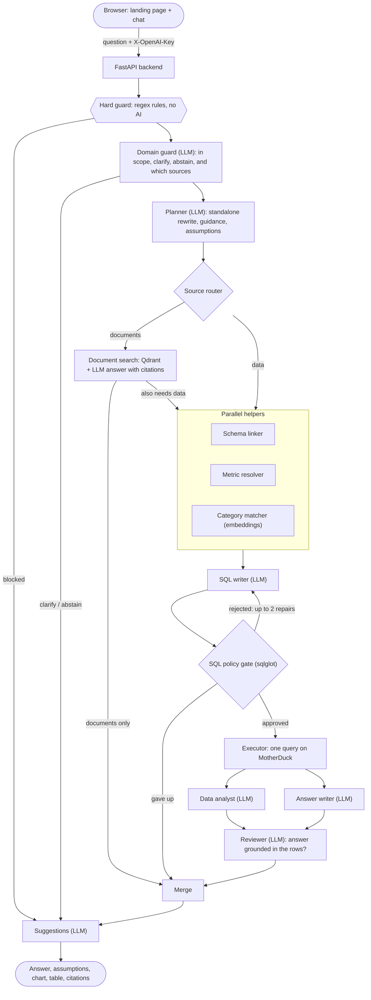

# Financial Multi-Agent Assistant

A student demo for safe, conversational analysis of a MotherDuck `financial_transactions` database and a set of synthetic bank documents. A FastAPI backend runs a bounded multi-agent workflow; a React frontend streams each agent's reasoning live.

- **Ask about the data**: questions become read-only SQL that is parsed and validated before it can run.
- **Ask about the documents**: questions about the fictional Larkspur Ridge Bank's filings, loans, complaints and compliance files are answered only from retrieved excerpts, with citations.
- **Bring your own key**: users enter their own OpenAI key on the landing page; it is tested before they can launch.

## Architecture



The graph is a fixed LangGraph `StateGraph` (`app/agents/text_to_sql/workflow.py`). Nothing in it is an open-ended agent loop: every stage has one job, and the number of repairs, executions and retrieved documents is bounded.

### Stages

| Stage | Kind | What it does |
|---|---|---|
| Hard guard | Plain rules | Blocks requests for credentials or secrets, private `source.*` tables, file or URL fetches, instruction-bypass phrasing and raw personal data, before any model sees them. |
| Domain guard | LLM | Routes the question as in scope, clarify or abstain, and picks the source (`sql`, `rag` or both). **The only agent allowed to ask you a clarifying question.** |
| Planner | LLM | Rewrites the question as a complete standalone one (resolving follow-ups such as "and for 2019"), writes guidance for the later agents and lists the assumptions it made. |
| Source router | Plain code | Sends the request to the documents, the data, or both. Drops the document source if no document store is configured. |
| Document search | Embeddings + LLM | Searches with both your wording and the planner's rewrite, merges the best matches, then writes an answer using only those excerpts and cites the ones it used. Never touches SQL. |
| Schema linker, metric resolver, category matcher | Plain code, embeddings | Run in parallel. Pick the relevant tables from `context/schema.yaml`, resolve governed business metrics from `context/semantics.yaml`, and match the question's meaning to merchant categories using a precomputed embedding cache. |
| SQL writer | LLM | Writes one `SELECT`. It cannot ask questions: returning no SQL just counts as a failed attempt. |
| SQL policy gate | sqlglot | Parses the query and enforces: one statement, `SELECT` only, approved `main` tables and columns (aliased or not), no wildcards, an approved function list, and a row limit of at most 100 (added automatically when missing). A rejection goes back to the writer with the reason, at most twice. |
| Executor | Plain code | Runs at most **one** approved query on MotherDuck. |
| Data analyst, answer writer | LLM | Run in parallel: insights and caveats, and a short grounded answer with an optional chart whose columns are checked against the real result. |
| Reviewer | LLM | Checks the answer against the actual rows before it is shown; otherwise you are asked for a narrower question. |
| Merge, suggestions | Plain code, LLM | Join the data and document answers, then propose up to three follow-ups from the intent and result *column names* (never the rows). |

### What the model never gets

- Database credentials. Database access, the SQL policy, execution limits and response serialization all live in application code.
- The ability to run anything the policy has not approved.
- Your data values, in the suggestions step.

### Request flow and streaming

`POST /api/chat/stream` streams server-sent events: a `progress` event as each graph node finishes, a `thought` event with that agent's plain-language decision, then a `result` (or an `error`). The frontend renders these live. `POST /api/chat` is the blocking equivalent. The final response carries the answer, SQL, columns and rows, chart, analysis, the **assumptions** the bot made, suggested questions, document citations and the route taken.

### Your OpenAI key

The landing page sends the key to `POST /api/validate-key`, which proves it with two tiny real calls (the chat model and the embedding model) and reports a specific reason if it fails. It never echoes the key, and attempts are rate limited per client. After that, chat requests carry the key in an `X-OpenAI-Key` header. It is scoped to that one request (a context variable, re-applied around every streamed step) and used for that user's OpenAI calls. It is not written to disk or logs. The browser keeps it in `sessionStorage` only, so it disappears when the tab closes. A key OpenAI rejects mid-session returns a 401 that sends the user back to the landing page.

`OPEN_AI_KEY` on the server is optional and only a fallback for requests that send no key. The generic `OPENAI_API_KEY` variable is deliberately ignored.

### Data and context

| Source | Used for |
|---|---|
| MotherDuck `main.transactions`, `cards`, `users`, `mcc_codes` | SQL answers |
| `context/schema.yaml`, `context/semantics.yaml` | The runtime contract: the only schema and business meaning ever put into a prompt |
| `context/mcc_embeddings.json` | Precomputed merchant-category embeddings (built offline by `scripts/prepare_mcc_embeddings.py`) |
| Qdrant collection `larkspur_ridge_bank_v1` | The 50 synthetic bank documents in `larkspur_ridge_bank_corpus/`, one embedding per document |

Conversation state (the last few questions and the tables the approved SQL actually used) is a 30-minute in-memory store, which is how follow-ups like "tell me the average" keep their topic.

### Frontend

`frontend/` is a Vite + React + TypeScript + Tailwind + shadcn/ui app with three pages:

- `/`: the landing page that tests your OpenAI key before launch.
- `/chat`: the streaming chat, with live agent thoughts and Answer / Assumptions / Chart / Table tabs.
- `/architecture`: an interactive, animated explainer of this very design: hover a component to light up its connections, watch a question travel through the graph with play, pause, step and scrub controls, and see a query checked rule by rule by the SQL gate. Its data files (`frontend/src/data/*.json`) are pinned to the real workflow graph and `SqlPolicy` by `tests/test_architecture_data.py`, so it cannot drift from the code.

### Endpoints

| Endpoint | Purpose |
|---|---|
| `GET /` and `GET /api/status` | Shows the backend is up: uptime, server time, whether the workflow has loaded (no secrets, no I/O) |
| `GET /health` | Minimal liveness check |
| `POST /api/validate-key` | Tests an OpenAI key with real calls |
| `POST /api/chat` | Blocking chat request |
| `POST /api/chat/stream` | Streaming chat (server-sent events) |

## Configuration

Create `.env` from `.env.example`. Required server-side values are:

- `OPEN_AI_MODEL`
- `MOTHERDUCK_TOKEN`

Optional:

- `OPEN_AI_KEY`: fallback for requests without a user key, and for the admin scripts that call OpenAI directly.
- `OPEN_AI_EMBEDDING_MODEL`: enables merchant-category matching, and the document branch together with Qdrant.
- `QDRANT_API_URL` and `QDRANT_API_KEY` (set together): enable the document branch.
- `LANGFUSE_PUBLIC_KEY` and `LANGFUSE_SECRET_KEY` (set together): redacted observability. `LANGFUSE_BASE_URL` and `LANGFUSE_VERBOSE_TRACING` are standalone options.
- `CORS_ALLOWED_ORIGINS`: the frontend origins allowed to call the API, comma-separated (for example `https://your-app.vercel.app`). Defaults to the local dev origins. Quotes, spaces and a trailing slash are ignored. An entry may use `*` for preview deployments, such as `https://your-app-*.vercel.app`; a bare `*` is not accepted. The effective value is logged at startup.

## Run locally

Backend:

```powershell
.\.venv\Scripts\Activate.ps1
python -m pip install -r requirements.txt
uvicorn app.api.main:app --reload
```

Frontend (in a second terminal; set `VITE_API_BASE_URL` in `frontend/.env` if the backend is not on port 8000):

```powershell
cd frontend
npm install
npm run dev
```

Or call the API directly:

```powershell
Invoke-RestMethod http://127.0.0.1:8000/api/status

Invoke-RestMethod -Method Post http://127.0.0.1:8000/api/chat `
  -Headers @{ 'X-OpenAI-Key' = 'sk-...' } `
  -ContentType 'application/json' `
  -Body '{"question":"Which merchant categories have the largest total positive recorded amounts?"}'
```

Send the returned `conversation_id` on the next request to continue the session.

## Standalone ingestion modules

`ingestion/motherduck.py` contains the financial dataset preparation and upload workflow, with `ingestion/motherduck_cli.py` as its command-line entry point.

`ingestion/documents/` loads the Larkspur Ridge corpus, embeds each document and upserts it into Qdrant. It is a dry run by default:

```powershell
.\.venv\Scripts\python.exe -m ingestion.documents.cli            # validate only
.\.venv\Scripts\python.exe -m ingestion.documents.cli --upload   # embed and upsert
.\.venv\Scripts\python.exe -m ingestion.documents.cli --evaluate # retrieval recall on the corpus's own questions
```

## Testing and evaluation

```powershell
.\.venv\Scripts\python.exe -m unittest discover -s tests -v
.\.venv\Scripts\python.exe scripts\run_evals.py
cd frontend; npm test; npm run build
```

Tests use fake specialists and fake database clients; they make no OpenAI, MotherDuck, Qdrant, or Langfuse request. The deterministic release gate runs 21 public, redacted, versioned fixtures in `evals/` through a network-free fake workflow. It checks routes, execution and repair budgets, declared specialist paths, approved suggestions, result digests/grounding, and supplied RAG citation metadata. See `evals/README.md` for the fixture counts and its limits. Expand this compact baseline with held-out, reviewed SQL, safety, multi-turn, and grounding cases before making a quality claim or publicly deploying the demo.

`scripts/eval_document_answers.py` is a separate, live check (real model and Qdrant, with an LLM judge) that runs the document corpus's 40 questions through the full workflow. It is not part of the offline gate.

## Deployment boundary

The current MotherDuck token is suitable for local work only. Before public hosting, use a restricted read-only serving credential that cannot access `source` tables, system tables, or filesystem/network extensions. Keep all secrets as server-side hosting variables.

Users' OpenAI keys travel to the backend in a request header, so serve it over HTTPS. The key-validation rate limiter is in memory, so it applies per server process.
