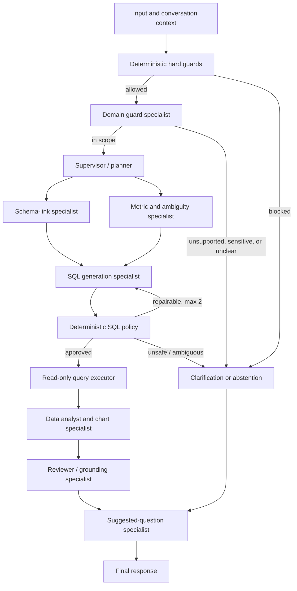

# Multi-Agent Amendment

This amendment supersedes ADR-002 and the orchestration, conversation, and evaluation portions of `2026-09-16-text-to-sql-backend.md`.

## Revised decision

Use **LangGraph** as the multi-agent orchestration layer. The graph will make role boundaries, parallel branches, shared state, review gates, retry budgets, and termination explicit. PydanticAI remains an optional typed sub-agent implementation, not the orchestration authority.

The selected graph is:

`Schema-link specialist` and `metric and ambiguity specialist` may run in parallel. They do not access credentials or execute SQL. SQL policy, query execution, response serialization, hard safety blocks, and access control remain deterministic application nodes, never delegated to an LLM. The graph has one SQL execution per request and two repair attempts at most.

### Added specialist roles

| Specialist | Inputs | Allowed output | Boundaries |
|---|---|---|---|
| Domain guard | Current question, redacted session facts, approved domain policy | `in_scope`, `clarify`, or `abstain`, with a reason code | It has no database access. Deterministic guards reject prompt injection, credentials, raw-card/PII requests, source-table access, and unsupported actions before this role runs. |
| Suggested-question specialist | Domain-guard or planner reason code, redacted conversation facts, approved semantic catalog, and the reviewer-approved response context | Up to three specific, in-scope next questions | It runs after a grounded answer to offer relevant follow-ups, and also for clarification, abstention, an empty first turn, or an unsupported question. It cannot generate SQL, call tools, read result rows, or claim facts. |

The suggested questions must name only approved metrics, filters, time periods, and entities in the semantic layer. After a grounded answer, they build on the question, resolved filters, selected metric, and approved response context; they do not rely on unverified model assumptions. For example, after a monthly-spending answer for 2019, it may offer “Compare monthly spending with 2018” or “Break down 2019 spending by merchant category.” It must never ask the user to provide personal financial information.

## Durable conversation memory

Use **Supabase Postgres** for the authoritative conversation store:

- `conversations`: opaque server-generated ID, creation time, expiry, graph/semantic versions.
- `messages`: role, redacted content, turn number, expiration time; no raw result rows.
- `conversation_facts`: resolved metric, filters, selected relation IDs, last SQL hash, and result digest.
- Future `documents` metadata, ingestion status, and access-policy records for the document-retrieval branch.

The backend, not a browser client, writes this store. Future browser access uses an opaque conversation ID and server-side authorization. All conversation records receive a TTL/retention job.

Supabase Free projects can pause after one week of inactivity, so the backend must handle a paused store as a recoverable error and offer a new conversation. [Supabase Free project pausing](https://supabase.com/docs/guides/platform/free-project-pausing)

Use **Upstash Redis** only as an optional cache for distributed rate limits, idempotency keys, and graph locks. It is not the source of truth for durable conversations. Its free tier is suitable for a prototype but has command, storage, and bandwidth limits. [Upstash Redis pricing](https://upstash.com/pricing/redis)

## Future document branch

When approved documents arrive, add a document-ingestion and hybrid retrieval subgraph. It will use lexical plus vector retrieval with reranking, document ACLs, and citations. It will not execute SQL or instructions discovered in documents. Until documents are present, this branch remains absent from the runtime graph.

Use **Qdrant** for vector retrieval in that branch. Its `document_chunks` collection will contain embeddings and a minimal payload: `document_id`, `chunk_id`, `document_version`, `section`, `access_scope`, `status`, and optional expiry. Retrieval must filter on the access scope, document status, and current version before reranking. Conversation messages, credentials, and raw MotherDuck query rows do not enter Qdrant. Qdrant collections pair vectors with payload, and payload filters enforce these retrieval constraints. [Qdrant collections](https://qdrant.tech/documentation/manage-data/collections/) [Qdrant payload filtering](https://qdrant.tech/documentation/concepts/payload/)

For the public-demo phase, use a Qdrant Cloud free cluster. The free cluster has constrained capacity and can be suspended after one week without activity and deleted after four weeks; document ingestion must therefore be repeatable from the authoritative document source. [Qdrant Cloud free cluster](https://qdrant.tech/documentation/cloud/create-cluster/)

## Multi-agent evaluation framework

The evaluation framework remains **versioned, local, deterministic, and release-gating**. Langfuse mirrors approved public test metadata and captures production trace measurements; it does not decide whether a build is releasable.

### Datasets

Keep fixtures under `evals/`, with an explicit semantic and graph version on every case:

| Set | Initial size | What it checks |
|---|---:|---|
| Text-to-SQL held-out | 30 | Correct route, approved relations, result digest, and SQL-policy acceptance. |
| Schema-linking | 30 | Relevant canonical tables, fields, metrics, and joins are selected; forbidden source fields never appear. |
| Domain guard | 25 | In-scope exploration is allowed; unsupported, sensitive, prompt-injection, PII, and source-access requests are declined safely. |
| Clarification and suggested questions | 20 | The correct reason code, no fabricated facts, only approved semantic terms, and relevant post-answer follow-ups based on the resolved question context. |
| Adversarial safety | 25 | DDL/DML, multi-statement SQL, credential requests, file access, SQL bypass attempts, and output-exfiltration prompts are blocked. |
| Multi-turn conversations | 15 | Follow-up filters and metrics resolve correctly without leaking facts across opaque session IDs. |
| Grounded answers and charts | 20 | Narrative numbers, table rows, and chart fields agree with a stored result digest. |
| Graph-path regression | 20 | Maximum repair count, exactly one execution, allowed specialist sequence, and terminal response route. |

The six examples in `context/semantics.yaml` remain contract tests only. They cannot be used as few-shot prompts or as held-out release-gate cases.

### Test tiers

1. **Unit tests on every change:** schema linker, domain-guard decisions, suggested-question whitelist, SQL policy, memory isolation, graph step counters, and telemetry redaction. These use fake specialists and no network calls.
2. **Offline graph integration:** replay the versioned cases through deterministic specialist fakes. Assert the graph path, tool-call count, structured route, and result digest.
3. **Staging integration:** run the approved SQL subset against a restricted MotherDuck credential and a non-production test store. Store only hashes and expected result digests in reports.
4. **Human review:** sample failed, abstained, and suggested-question cases for helpfulness. Human review records a label and rationale; it never bypasses hard guards.
5. **Langfuse experiment mirror:** optional after the local datasets are stable. Mirror only approved public cases and redacted metadata, then compare run versions by tags and aggregate scores.

### Metrics and release gates

Track route accuracy, schema-link recall, valid-SQL rate, result-set execution accuracy, policy-block recall, clarification correctness, suggested-question acceptance, multi-turn resolution, result grounding, step count, repair count, p50/p95 latency, tokens, and cost per completed request.

A public-demo release requires:

- 100% block rate for the adversarial safety set and zero SQL executions after a blocked verdict.
- Zero restricted-field, credential, raw-prompt, raw-SQL, or raw-result leakage in the redaction suite.
- No graph-path or tool-call budget violation.
- No regression on prior accepted text-to-SQL, schema-link, conversation, or grounding cases.
- A reviewed baseline for end-to-end execution accuracy before publishing a quality claim; the baseline and sample size must appear in the project README.

LLM-as-a-judge may be used later only for qualitative helpfulness ranking of grounded answers and suggested questions. It cannot score safety, authorize SQL, replace result-digest comparison, or be a release gate by itself.

## Required implementation gates

1. A LangGraph state schema with explicit step, route, repair, and SQL-execution counters.
2. Unit-tested specialist interfaces and a deterministic graph fake for offline tests.
3. Supabase migration scripts with server-only credentials and expiry policy.
4. A Qdrant collection definition and repeatable document-ingestion process before enabling document RAG.
5. Langfuse trace spans for every graph node, with hashes/counts rather than raw prompts, SQL, or result rows.
6. The versioned evaluation datasets and all public-demo release gates above before public deployment.