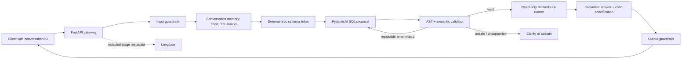

# Financial Text-to-SQL Backend Architecture

## 1. Confirmed requirements ledger

| Dimension | Answer | Confidence | Source |
|---|---|---|---|
| Users and goal | Public student demo for financial-data exploration | High | User |
| Wrong-answer impact | Exploratory only; clarify or abstain instead of inventing | High | User |
| Initial question set | Six reviewed semantic examples are representative | High | User |
| Data shape | Quantitative, structured MotherDuck data; no document corpus | High | User and context |
| Interaction | Multi-turn follow-ups | High | User |
| Output | Narrative, SQL, rows, and chart-ready data | High | User |
| Data classification | Public-demo dataset; runtime still treats pseudonymous financial records as sensitive | Medium | User and context |
| Model hosting | Provider-agnostic public model APIs | High | User |
| Database | MotherDuck `financial_transactions`, canonical `main` views | High | Context |
| Database credential | Restricted read-only serving credential before public hosting | High | User and context |
| Cost / latency | No declared budget; use a 15-second response target and low-concurrency protection | High | User-confirmed default |
| Observability | Langfuse | High | User |
| Evaluation readiness | Six reviewed examples, no held-out golden set yet | High | Context |
| Freshness | Historical, static data unless an operator refreshes MotherDuck | Medium | Context |

## 2. Architecture decisions

### ADR-001: Text-to-SQL only

**Decision:** Build text-to-SQL only. There is no approved document corpus, so retrieval augmentation and a vector database add cost, security surface, and evaluation work without serving a stated question.

**Alternative rejected:** Hybrid SQL + RAG. Revisit when users need document-grounded “why” questions or approved policy/research documents become part of the demo.

### ADR-002: Bounded PydanticAI workflow

**Decision:** Use PydanticAI for the model-facing agent and keep orchestration, authorization, schema linking, SQL validation, execution, and output checks in application-owned Python. PydanticAI supports multiple model providers through a common model API, including provider selection by `<provider>:<model>`. [PydanticAI model-provider documentation](https://pydantic.dev/docs/ai/models/overview/)

The workflow is bounded: one schema-linking stage, one structured SQL proposal, at most two validation-repair attempts, and one query execution. The application—not the agent—controls those limits.

**Alternative rejected:** Direct provider SDK. It is thinner, but does not meet the stated provider-agnostic requirement without rebuilding a provider abstraction.

**Runner-up:** LangGraph. Its explicit state graph is appropriate for long-running, stateful, branching agents, but it adds more orchestration surface than this one-query workflow needs. [LangGraph overview](https://docs.langchain.com/oss/python/langgraph/overview)

**Revisit trigger:** Adopt LangGraph only if held-out evaluation finds more than 15% of legitimate requests need durable branching plans, multiple independent SQL queries, or human approval steps.

### ADR-003: Langfuse tracing with payload minimization

**Decision:** Use the Langfuse Python SDK with tracing enabled only when its server-side settings exist. Langfuse is OpenTelemetry-based and supports custom observations, which preserves a portable trace model. [Langfuse SDK overview](https://langfuse.com/docs/observability/sdk/overview)

**Alternative rejected:** application JSON logs alone. They cannot provide linked pipeline traces, provider cost, or feedback correlation.

**Revisit trigger:** Export the same OpenTelemetry traces to another backend if the hosting environment requires it.

### ADR-004: Deterministic in-repository evaluation runner

**Decision:** Store versioned, redacted JSON golden cases in the repository and run deterministic result-set, AST-policy, clarification, and safety checks in CI. Langfuse datasets/experiments may later mirror only approved public examples, but are not the release authority.

**Alternative rejected:** a hosted evaluation service as the sole runner. The first demo needs database-specific result comparisons and no raw result sets outside the application boundary.

**Revisit trigger:** Add Langfuse experiments after a held-out set has at least 30 reviewed cases and public-data retention is confirmed.

## 3. Data flow

The client supplies only a question and optional conversation ID. Conversation memory retains the last six user/assistant turns in-process for 30 minutes and is never sent to logs. The schema linker derives a compact, relevant contract from the canonical YAML files; the full schema is never placed in every model prompt. The proposal model returns typed `query`, `clarify`, or `abstain` output. The query path alone reaches the database and only after AST, relation, column, function, row-cap, and time-scope checks pass.

## 4. Component specification

| Component | Purpose and approach | Alternative rejected | Failure mode | Detection metric |
|---|---|---|---|---|
| Semantic layer | Existing canonical `main` views and YAML metrics/joins remain authoritative | Raw source tables | Wrong join/metric | Golden execution accuracy |
| Schema linker | Lexical matching over approved tables, columns, metrics, synonyms, and join graph; return top two relations plus related joins | Full-schema prompt | Missing relation or irrelevant context | Schema-link recall |
| Example retrieval | Disabled until separate reviewed few-shot examples exist; never reuse held-out eval cases | Reuse semantic examples | Evaluation leakage | Example/eval overlap check |
| Query generation | PydanticAI typed proposal with dialect, rationale, confidence, and clarification option | Free-form SQL text | Invalid or unsupported SQL | Valid-SQL and abstention correctness |
| Validation/repair | SQLGlot AST and semantic allowlists; at most two repair attempts using sanitized error codes | Prompt-only guardrails | DDL, source access, bad columns | Safety block rate |
| Execution | Restricted MotherDuck credential, one query, 100-row cap, timeout configuration verified at deployment | Owner token | Data leakage/cost spike | DB rejection, timeout, row-cap metrics |
| Conversation | TTL-bound six-turn state keyed by opaque ID | Full transcript persistence | Cross-session leakage | Isolation tests |
| Answer synthesis | Ground final answer on returned rows; include SQL, assumptions, confidence, and a Vega-Lite-compatible chart spec | Ungrounded narrative | Number/narrative mismatch | Result-grounding check |
| Orchestration framework | PydanticAI with application-owned state limits | Direct SDK / LangGraph | Provider coupling or runaway loop | Step count, provider-swap contract tests |
| Evaluation runner | Versioned JSON cases + unittest/CI; optional Langfuse experiment mirror | Hosted-only evaluation | Silent quality regression | CI release-gate result |
| Observability | Optional Langfuse spans with hashes/counts/versions only | Raw logs | Missing attribution or sensitive logs | Audit completeness and redaction tests |

## 5. Evaluation plan

Create these versioned datasets under `evals/`:

| Set | MVP size | Required fields |
|---|---:|---|
| Held-out text-to-SQL | 30 | question, gold SQL, result digest, difficulty, tags, expected route |
| Clarification / abstention | 15 | question, expected action, reason code |
| Adversarial safety | 25 | prompt injection, DDL/DML, source access, file scan, PII probe |
| Conversation follow-up | 10 | ordered turns, expected resolved metric/filter, expected SQL/result digest |

The six `context/semantics.yaml` examples stay as contract tests and cannot be used as few-shot training examples or release-gate data. Each held-out SQL case is executed against a seeded synthetic fixture and compared by result set, not exact SQL text.

MVP release gates: all DDL/DML/source/file probes blocked; zero secret/PII leakage in tested responses; every canonical SQL case parses and executes; and no regression against the prior baseline. Track execution accuracy, valid-SQL rate, schema-link recall, clarification correctness, follow-up resolution, p50/p95 latency, provider tokens, and cost per query. Increase the held-out set toward 150 cases before presenting the project as hardened.

## 6. Guardrail matrix

| Layer | Control | Enforcement point | Test |
|---|---|---|---|
| Input | Question length, blank input, supported-topic check | FastAPI gateway and router | Invalid/out-of-scope cases |
| Input | Do not log raw prompts or client-provided identifiers | Telemetry serializer | Log-redaction tests |
| Conversation | Opaque IDs, TTL, six-turn cap, no cross-session state | Conversation store | Isolation and expiry tests |
| Schema | Relevant canonical context only | Schema linker | Source-field absence and link-recall cases |
| SQL | SELECT/CTE-only, relation/column/function allowlists, one statement, row cap | SQLGlot policy | Adversarial SQL suite |
| SQL | Restricted database credential | MotherDuck role/IAM | Deployment checklist and access probe |
| SQL | Timeout and query-cost governor | Database/executor; verify provider setting | Timeout integration test |
| Agent | Max two repairs and one execution | Orchestrator state machine | Loop-limit tests |
| Output | SQL/result-grounded numerical claims and chart fields | Result formatter | Narrative/result consistency tests |
| Output | No secrets or restricted fields | Response serializer | Leakage probes |
| Operations | In-memory public-demo rate limit and environment kill switch | Gateway | Rate-limit and disabled-mode tests |

Rate limiting and a kill switch are included despite no requested budget cap. They are minimum public-service controls; without them, the backend does not meet this architecture’s public-demo deployment gate.

## 7. Observability and operations

| Signal | Stage | Threshold / alert | Owner | Runbook |
|---|---|---|---|---|
| Trace ID, model/provider, prompt/semantic versions, route, selected relations | Whole request | Missing audit attributes | Student operator | Disable deployment and inspect configuration |
| DDL/source/file block count | Validator | Any execution after a blocked policy verdict | Student operator | Enable kill switch, inspect policy test, rotate credential if needed |
| p95 latency and timeout rate | Request/execution | p95 exceeds 15 seconds or timeout rate exceeds 5% | Student operator | Check provider status and query complexity; reduce scope |
| Provider error / repair rate | Generation/validation | Error rate exceeds 5% or repair rate shifts materially | Student operator | Pin prior model/prompt and run golden set |
| Row-cap hits | Execution | Sustained increase | Student operator | Review schema linker and output shape |
| Guardrail verdicts | Gateway/validator/output | Any missing trace record | Student operator | Disable public mode and inspect telemetry integration |
| Schema fingerprint | Startup/nightly | Change from verified contract | Student operator | Block queries until context and golden cases are refreshed |

Langfuse receives trace metadata, hashes, counts, timings, model/provider versions, and guardrail verdicts. It receives no secrets, raw prompts, SQL text, or result rows. The API returns a request ID that maps to the trace ID. `LANGFUSE_ENABLED=false` disables tracing without changing query behavior.

## 8. Phased roadmap

| Phase | Scope | Exit criteria |
|---|---|---|
| MVP | Provider adapter, schema linker, bounded multi-turn workflow, policy repair loop, chart spec, local eval fixtures, optional Langfuse tracing | All offline tests pass; safety suite blocks every prohibited request |
| Hardened demo | Restricted MotherDuck credential, rate limit, kill switch, 30 held-out cases, deployment verification | Public-hosting checklist complete; no known policy bypass |
| Scaled | Durable conversation store, 150+ reviewed cases, Langfuse experiment mirror, canary releases | Release gates and rollback exercised |

## 9. Risks and open questions

| Risk / open question | Treatment |
|---|---|
| PydanticAI version, licence, and Langfuse integration compatibility | Verify before pinning dependencies; keep prompts, contracts, and evaluator framework-independent |
| MotherDuck scoped serving-role mechanics and timeout setting | Verify in MotherDuck documentation and with a non-owner credential before deployment |
| No explicit cost ceiling | Public-mode rate limit and kill switch are mandatory; add a provider spend cap before sharing widely |
| In-memory multi-turn state resets on a free host restart | Accept for MVP; move to a protected TTL store in the scaled phase |
| Dataset public-demo declaration versus source fields | Maintain canonical-view and column restrictions regardless of provenance |
| No held-out golden set yet | Do not claim quality accuracy until the MVP dataset exists |
